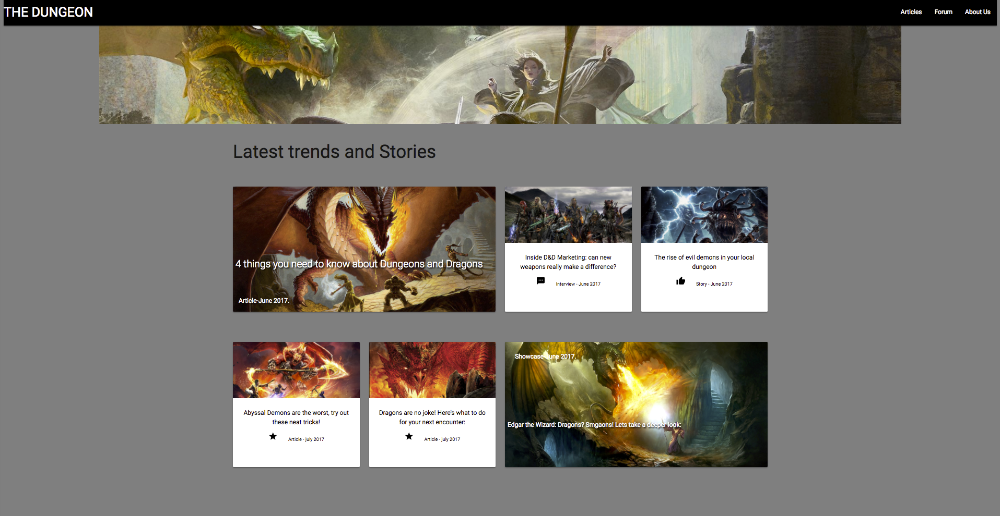

# _Responsive Design Independent Project_

#### By **Joe Parsley, 06/02/2017**

## Description

## Setup/Installation Requirements

* Open CMD/Terminal
* git clone `https://github.com/joeparsley/Responsive-Design-Project`
* Open index.html file in a browser such as Google Chrome

## Screenshot of Project

## How to Use

* Open index.html in a web browser such as Google Chrome

## Known Bugs

* None reported at this time!

## Support and contact details

* Feel free to reach out with suggestions at voodoojoenut@gmail.com

## Technologies Used

**Main Languages used:**

* HTML
* CSS

**Other Technologies:**

* Font Awesome
* Google Fonts
* Materialize.CSS
* jQuery

## License

This project is licensed under the MIT License

**_Joe Parsley_** Copyright (c) 2017
